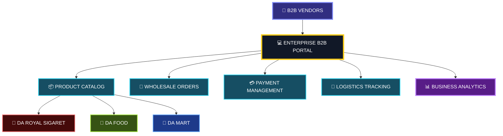
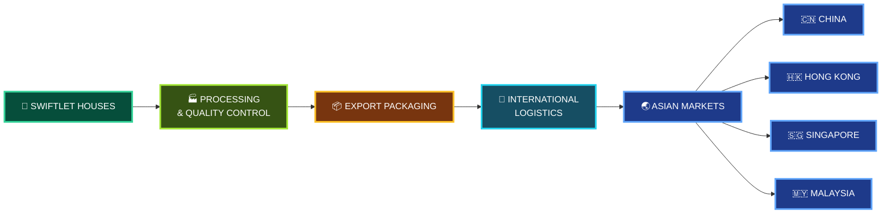
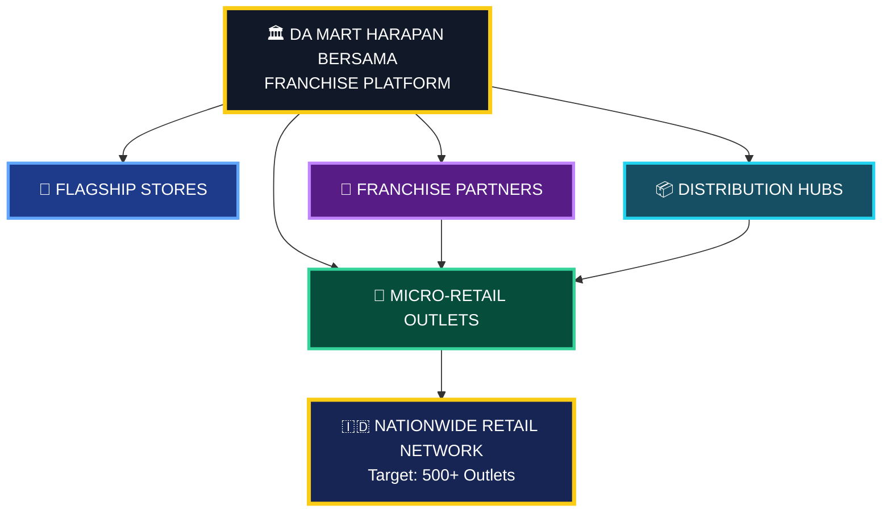
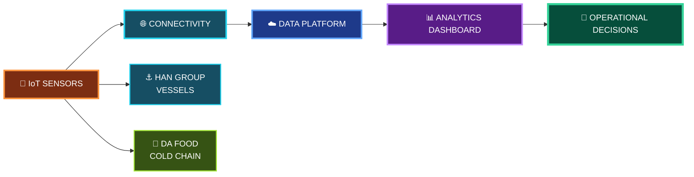
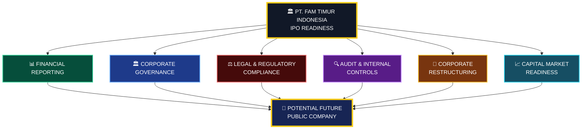
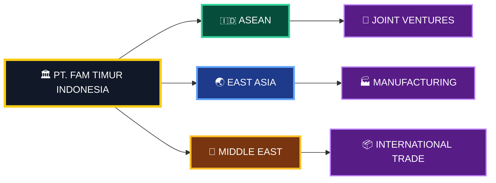
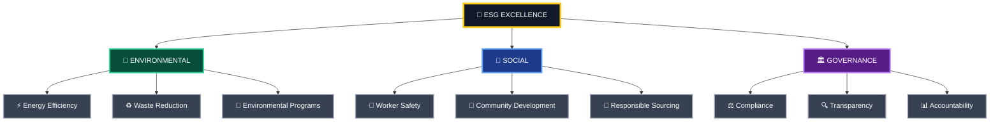
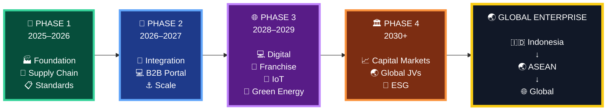
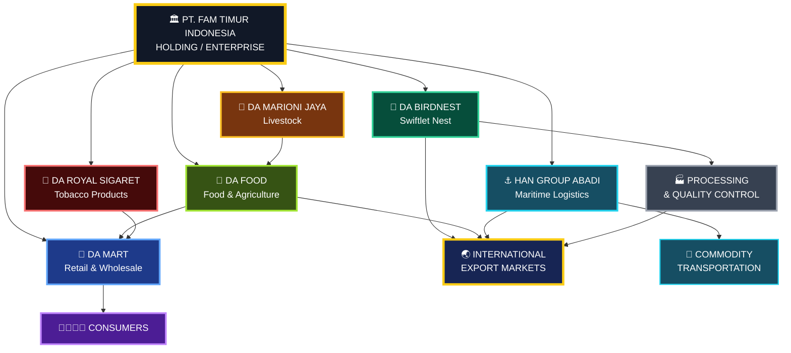
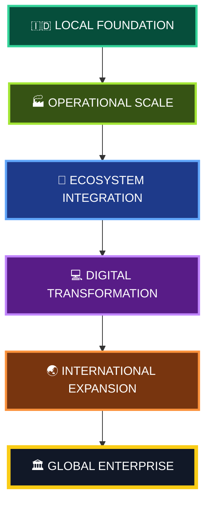

# 🏛️ PT. FAM Timur Indonesia
### 🚀 Corporate Growth Roadmap & Strategic Development Plan

> **Building an integrated multi-industry enterprise across Indonesia — from agriculture and food production to retail, livestock, tobacco, maritime logistics, technology, and international markets.**

---

## 🗺️ Strategic Roadmap

Our long-term development roadmap is structured into **four strategic phases**, designed to strengthen operational foundations, integrate business units, accelerate digital transformation, and establish a globally competitive enterprise.

```mermaid
flowchart TB
    A["🏛️ PT. FAM TIMUR INDONESIA<br/>Integrated Enterprise"]:::holding

    A --> P1["🚀 PHASE 1<br/>Institutional Foundation<br/>& Supply Chain Stabilization<br/>2025–2026"]:::phase1
    P1 --> P2["🔄 PHASE 2<br/>Cross-Industry Ecosystem Synergy<br/>2026–2027"]:::phase2
    P2 --> P3["🌐 PHASE 3<br/>Digital Transformation<br/>& Market Leadership<br/>2028–2029"]:::phase3
    P3 --> P4["🏛️ PHASE 4<br/>Capital Market Expansion<br/>& Global Enterprise<br/>2030+"]:::phase4
    P4 --> V["🌏 GLOBAL ENTERPRISE<br/>Indonesia → ASEAN → Global"]:::vision

    classDef holding fill:#111827,stroke:#facc15,stroke-width:4px,color:#ffffff;
    classDef phase1 fill:#064e3b,stroke:#34d399,stroke-width:3px,color:#ffffff;
    classDef phase2 fill:#1e3a8a,stroke:#60a5fa,stroke-width:3px,color:#ffffff;
    classDef phase3 fill:#581c87,stroke:#c084fc,stroke-width:3px,color:#ffffff;
    classDef phase4 fill:#7c2d12,stroke:#fb923c,stroke-width:3px,color:#ffffff;
    classDef vision fill:#172554,stroke:#facc15,stroke-width:4px,color:#ffffff;
````

---

# 🚀 Phase 1: Institutional Foundation & Supply Chain Stabilization

### 📅 2025–2026

The first phase focuses on strengthening operational foundations, improving production standards, expanding supply networks, and establishing reliable infrastructure across the core business units.

---

## 🪹 Swiftlet Nest — *DA Birdnest Indonesia*

### 🎯 Strategic Objectives

* [x] 🏭 Standardize processing facilities according to international health & sanitation guidelines.
* [ ] 📜 Secure **ISO 22000** & **HACCP** certifications for raw and processed swiftlet nest exports.
* [ ] 🤝 Establish direct sourcing partnerships with swiftlet house owners across **South Sulawesi and Kalimantan**.

### 🌏 Long-Term Direction

> Build a standardized and traceable swiftlet nest supply chain capable of serving premium domestic and international markets.

---

## 🌾 Food & Agriculture — *DA Food Indonesia*

### 🎯 Strategic Objectives

* [x] 🚚 Establish regional distribution networks for staple foods and processed snacks.
* [ ] ❄️ Implement cold-chain logistics infrastructure to preserve fresh agricultural produce.
* [ ] 🤝 Form strategic partnerships with local farmer cooperatives across **Eastern Indonesia**.

### 🌱 Long-Term Direction

> Develop an integrated agricultural ecosystem connecting farmers, processing facilities, logistics networks, and retail distribution.

---

## 🚬 Premium Cigarettes — *PT. DA Royal Sigaret*

### 🎯 Strategic Objectives

* [x] 🏭 Optimize factory production lines and quality control protocols for tobacco products.
* [ ] 📦 Expand distributor partnerships across **Sulawesi, Maluku, and Papua** territories.

### 📈 Long-Term Direction

> Strengthen production efficiency, quality control, and regional distribution capabilities.

---

## 🛒 Retail & Wholesale — *DA Mart Harapan Bersama*

### 🎯 Strategic Objectives

* [x] 🏪 Open initial flagship retail centers supplying daily household necessities.
* [ ] 💻 Deploy localized **Point-of-Sale (POS)** and inventory control systems.

### 🛍️ Long-Term Direction

> Build a scalable retail network capable of connecting locally sourced products with consumers across Indonesia.

---

## 🥩 Livestock — *PT. DA Marioni Jaya*

### 🎯 Strategic Objectives

* [x] 🐄 Expand cattle, poultry, and dairy farming capacity.
* [ ] 🌾 Build integrated feed mill facilities to minimize operational upstream costs.

### 🔄 Long-Term Direction

> Establish an integrated livestock ecosystem covering animal production, feed supply, processing, and downstream food distribution.

---

## ⚓ Coal Mining & Maritime Logistics — *PT. HAN GROUP ABADI*

### 🎯 Strategic Objectives

* [x] 📜 Secure long-term stevedoring and coal transhipment operational permits in Western and Southern Aceh.
* [ ] 🚢 Expand tugboat and barge fleet capacity for high-volume maritime transport.

### ⚓ Long-Term Direction

> Develop reliable maritime logistics infrastructure supporting high-volume commodity transportation.

---

# 🏭 Phase 1 — Six Corporate Pillars

```mermaid
flowchart LR
    H["🏛️ PT. FAM TIMUR INDONESIA"]:::holding

    H --> B["🪹 DA BIRDNEST<br/>Swiftlet Nest"]:::birdnest
    H --> F["🌾 DA FOOD<br/>Food & Agriculture"]:::food
    H --> R["🚬 DA ROYAL SIGARET<br/>Premium Tobacco"]:::tobacco
    H --> M["🛒 DA MART<br/>Retail & Wholesale"]:::retail
    H --> L["🥩 DA MARIONI JAYA<br/>Livestock"]:::livestock
    H --> S["⚓ HAN GROUP ABADI<br/>Maritime Logistics"]:::maritime

    classDef holding fill:#111827,stroke:#facc15,stroke-width:4px,color:#ffffff;
    classDef birdnest fill:#064e3b,stroke:#34d399,stroke-width:3px,color:#ffffff;
    classDef food fill:#365314,stroke:#a3e635,stroke-width:3px,color:#ffffff;
    classDef tobacco fill:#450a0a,stroke:#f87171,stroke-width:3px,color:#ffffff;
    classDef retail fill:#1e3a8a,stroke:#60a5fa,stroke-width:3px,color:#ffffff;
    classDef livestock fill:#78350f,stroke:#fbbf24,stroke-width:3px,color:#ffffff;
    classDef maritime fill:#164e63,stroke:#22d3ee,stroke-width:3px,color:#ffffff;
```

---

# 🔄 Phase 2: Cross-Industry Ecosystem Synergy

### 📅 2026–2027

The second phase focuses on connecting individual business units into a coordinated **cross-industry ecosystem**.

---

## 🔗 Vertical Integration

> 🥩 **PT. DA Marioni Jaya** → 🌾 **DA Food Indonesia** → 🛒 **DA Mart Harapan Bersama**

Feed raw output from **PT. DA Marioni Jaya** directly into **DA Food Indonesia** processing operations and subsequently into **DA Mart Harapan Bersama** retail channels.


---

## 💻 B2B Supply Chain Portal

Develop a centralized enterprise portal enabling wholesale vendors to efficiently order:

* 🚬 Tobacco products — **DA Royal Sigaret**
* 🌾 Consumer & food products — **DA Food Indonesia**
* 🛒 Retail merchandise — **DA Mart Harapan Bersama**



---

## ⚓ Maritime Transhipment Scale

Increase monthly coal throughput capacity under **PT. HAN GROUP ABADI** by a targeted **45%**, subject to operational feasibility, regulatory requirements, and fleet modernization.

### 🚢 Modernization Focus

* ⚓ Tugboat capacity
* 🛳️ Barge capacity
* 📡 Fleet monitoring
* 🔧 Preventive maintenance
* 📊 Operational analytics

---

## 🪹 Swiftlet Export Hub

Establish direct export channels for premium swiftlet nests targeting major Asian markets:

🇨🇳 **China**
🇭🇰 **Hong Kong**
🇸🇬 **Singapore**
🇲🇾 **Malaysia**



---

# 🌐 Phase 3: Digital Transformation & Market Leadership

### 📅 2028–2029

The third phase emphasizes technology adoption, scalable retail expansion, product innovation, smart logistics, and sustainability initiatives.

---

## 🛒 DA Mart Franchise Model

Expand **DA Mart Harapan Bersama** toward a nationwide franchise model targeting:

### 🎯 500+ Micro-Retail Outlets



---

## 🧪 High-Value Product R&D

Develop potential derivative product lines using **DA Birdnest** extracts, subject to applicable regulatory requirements, scientific validation, product safety standards, and market authorization.

Potential categories include:

* 🌿 Wellness products
* 🥗 Dietary products
* 🧴 Skincare products
* 🧪 Functional ingredient development

---

## 📡 Smart Logistics & IoT

Deploy IoT-enabled monitoring systems across:

### ⚓ PT. HAN GROUP ABADI

* 🚢 Maritime vessels
* 📍 GPS tracking
* ⛽ Fuel monitoring
* 🔧 Equipment monitoring
* 📊 Fleet analytics

### 🌾 DA Food Indonesia

* 🚚 Cold-chain vehicles
* 🌡️ Temperature monitoring
* 📍 Real-time vehicle tracking
* 📦 Shipment monitoring
* 📊 Logistics analytics



---

## 🌱 Green Energy Transition

Implement sustainability initiatives across mining, logistics, agriculture, and processing operations.

Potential initiatives include:

* 🌳 Carbon-offset programs
* ☀️ Renewable energy evaluation
* ⚡ Energy-efficiency programs
* ♻️ Waste reduction
* 💧 Resource-efficiency initiatives
* 📊 Environmental monitoring

---

# 🏛️ Phase 4: Capital Market Expansion & Global Enterprise

### 📅 2030+

The fourth phase focuses on corporate maturity, international expansion, capital-market readiness, and long-term sustainability.

---

## 📈 Holding Company IPO Preparation

Prepare **PT. FAM Timur Indonesia** for potential corporate restructuring and future **Initial Public Offering (IPO)** readiness on the **Indonesia Stock Exchange (IDX)**, subject to corporate, financial, legal, regulatory, and market requirements.

### 🏛️ Preparation Areas



> ⚠️ IPO readiness does not represent a guarantee or commitment to conduct an IPO. Any future capital-market transaction would be subject to applicable regulations, professional advice, market conditions, and corporate approvals.

---

## 🌏 International Joint Ventures

Establish strategic cross-border partnerships across:

🇮🇩 **ASEAN**
🌏 **East Asia**
🕌 **Middle East**

Potential cooperation areas:

* 🤝 Joint ventures
* 📦 International supply chains
* 🏭 Manufacturing partnerships
* 🚢 Logistics
* 🌾 Agriculture
* 🛒 Retail
* 🧪 Product development
* 🌐 Technology



---

# 🌱 Sustainable ESG Excellence

Progressively align all **six corporate pillars** with internationally recognized **Environmental, Social, and Governance (ESG)** principles.

| Pillar               | Focus                                                        |
| -------------------- | ------------------------------------------------------------ |
| 🌱 **Environmental** | Energy, emissions, waste, biodiversity & resource efficiency |
| 👥 **Social**        | Employees, communities, safety & responsible sourcing        |
| 🏛️ **Governance**   | Ethics, transparency, compliance & accountability            |



---

# 🧭 Four-Phase Growth Journey



---

# 🏢 Six Corporate Pillars

| #   | Business Pillar                | Strategic Role                           |
| --- | ------------------------------ | ---------------------------------------- |
| 1️⃣ | 🪹 **DA Birdnest Indonesia**   | Swiftlet nest production & export        |
| 2️⃣ | 🌾 **DA Food Indonesia**       | Food & agricultural processing           |
| 3️⃣ | 🚬 **PT. DA Royal Sigaret**    | Tobacco product manufacturing            |
| 4️⃣ | 🛒 **DA Mart Harapan Bersama** | Retail & wholesale distribution          |
| 5️⃣ | 🥩 **PT. DA Marioni Jaya**     | Livestock & agricultural production      |
| 6️⃣ | ⚓ **PT. HAN GROUP ABADI**      | Maritime logistics & commodity transport |

---

# 🔗 Integrated Business Ecosystem



---

# 📊 Strategic Priorities

The roadmap is built around several long-term priorities:

### 🏭 Operational Excellence

Standardized production, quality control, compliance, and operational efficiency.

### 🔗 Supply Chain Integration

Connecting upstream production with processing, distribution, logistics, and retail.

### 💻 Digital Transformation

Modern POS, ERP/B2B systems, IoT, analytics, and digital supply-chain infrastructure.

### 🌏 International Expansion

Developing export channels and international strategic partnerships.

### 🌱 Sustainability

Progressively integrating ESG principles and resource-efficient operations.

### 📈 Corporate Governance

Building transparent, scalable, compliant, and investment-ready corporate structures.

---

# 🎯 Long-Term Vision

> **To build PT. FAM Timur Indonesia into an integrated Indonesian enterprise connecting agriculture, food, livestock, retail, manufacturing, maritime logistics, technology, and international trade.**



---

# 🚀 Vision Statement

## **Build locally. Integrate strategically. Transform digitally. Expand globally.**

### 🇮🇩 Indonesia → 🌏 ASEAN → 🌐 Global

---

# 📌 Roadmap Status

| Category                      | Status                   |
| ----------------------------- | ------------------------ |
| 🏛️ Corporate Roadmap         | 🟢 Active Development    |
| 🏭 Institutional Foundation   | 🟢 Ongoing               |
| 🔗 Supply Chain Integration   | 🟡 Planned / Developing  |
| 💻 Digital Transformation     | 🟡 Planned               |
| 🌏 International Expansion    | 🟡 Long-Term             |
| 📈 Capital Market Preparation | ⚪ 2030+                  |
| 🌱 ESG Development            | 🟡 Progressive Alignment |

---

# 🏁 Final Message

> 🚀 **Dream fast. Build fast. Verify every milestone.**

> 🇮🇩 **PT. FAM Timur Indonesia — Building an Integrated Indonesian Enterprise.**

---

### 📜 Disclaimer

This roadmap represents a **strategic development plan and forward-looking corporate vision**.
Targets, timelines, certifications, expansion plans, financing activities, IPO preparation, international partnerships, and operational capacities remain subject to:

* ⚖️ Applicable laws and regulations
* 📋 Required licenses and permits
* 🏛️ Corporate approvals
* 💰 Financial feasibility
* 📊 Market conditions
* 🤝 Strategic partnerships
* 🔍 Due diligence
* 🌱 Environmental and social considerations

**All roadmap milestones should be independently verified and formally approved before being represented as completed achievements.**

```
